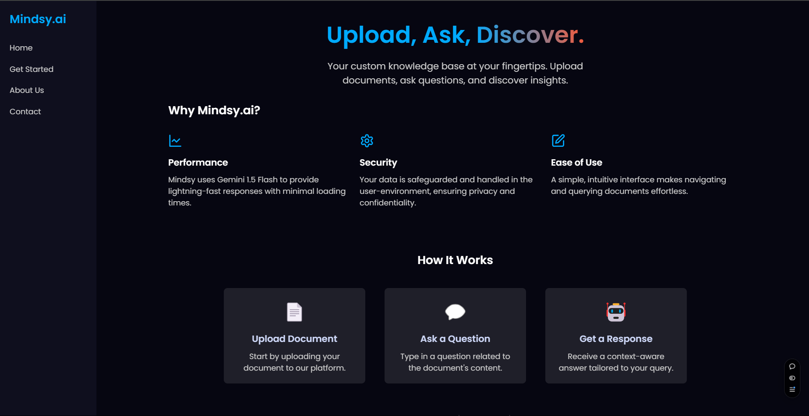

# Mindsy.ai 



Mindsy.ai is a web application that allows users to upload documents, ask context-aware questions, and receive AI-generated responses. Built with a seamless React frontend and a robust FastAPI backend, the platform is designed to support professionals in domains like finance, legal, and healthcare by simplifying information retrieval from large documents. 

## **Features**

1. **Secure Document Upload**  
   - The platform ensures data privacy and secure handling of uploaded files.  

2. **Context-Aware AI Responses**  
   - Provides highly accurate and context-aware answers based on the uploaded document.  
   - Ideal for professionals in finance, legal, healthcare, and more.  

3. **Image and OCR Support**  
   - Extracts text from image-based documents with high accuracy using OCR (Optical Character Recognition).  
   - Can read and derive insights from images embedded in docs including graphs, pie charts, etc. making it perfect for financial use-cases.

4. **Markdown-Formatted Responses**  
   - AI-generated responses are displayed in Markdown syntax, ensuring readability with formatted text, headings, bullet points, and code blocks.  

5. **High-Performance Platform**  
   - Optimized backend ensures fast query processing with minimal latency.  
   - Can handle large documents and complex queries efficiently.  


In the above example, the app accurately understands a pie chart from a specifically mentioned page and provides a response in minimal time.

## Tools and Technologies Used
  
- **FastAPI:** Handles API endpoints for document uploads and query processing.  
- **Python:** Used to implement the backend logic, including integration with LLMs.  
- **Uvicorn:** ASGI server for running the FastAPI backend.  
- **Gemini 1.5 Flash API:** Processes user queries and generates responses using uploaded document context.  
- **React.js:** Component-based library for building the user interface.  
- **React-Markdown:** Displays AI responses with proper Markdown formatting.

## Running the Project
You can visit https://mindsy-ai.vercel.app to checkout the interface. To run it locally, follow the steps provided below.

### 1. Clone the Repository
```bash  
git clone https://github.com/ashmit0920/mindsy.ai.git  
cd mindsy.ai  
```

### 2. Get an API key from Google
1. Head to [Google AI Studio](https://ai.google.dev/gemini-api/docs) and get an API key for the Gemini 1.5 Flash model. It is free of cost and has a rate limit of 15 RPM and 1 million TPM (tokens per minute).

2. Open the `sample.env` file in the root directory and paste your API key.
   ```bash
   gemini_key = "YOUR_API_KEY" # do not rename the variable 'gemini_key'.
   ```

### 3. Setting Up the Frontend 
1. Navigate to the `landing-page` directory:

   ```bash  
   cd landing-page  
   ```  
2. Install the dependencies:  

   ```bash  
   npm install  
   ```  
3. Start the React development server:  

   ```bash  
   npm start  
   ```  
   The frontend will run at `http://localhost:3000/`.  

### 4. Setting Up the Backend
1. Navigate to the `root` directory:

   ```bash  
   cd ..
   ```  
2. Create a Python virtual environment (optional but recommended):  

   ```bash  
   python -m venv env  
   env/Scripts/activate  # On Linux, use `source env/bin/activate`  
   ```  
3. Install the required Python dependencies:  

   ```bash  
   pip install -r requirements.txt  
   ```
4. Start the FastAPI backend using Uvicorn:  

   ```bash  
   uvicorn main:app --reload  
   ```  
   The backend will run at `http://127.0.0.1:8000/`.  


### 4. Testing the Platform 
1. Open the frontend in a web browser at `http://localhost:3000/`.  
2. Navigate to the "Get Started" page via the sidebar to access the chat interface.
3. Upload a document using the file uploader.  
4. Enter a query and receive AI-generated responses based on the uploaded document.  


## Folder Structure
```
mindsy.ai/  
│  
├── landing-page/  
│   ├── src/  
│   │   ├── components/   # React components (Sidebar, Chat Interface, etc.)  
│   │   ├── App.js        # Main React file  
│   │   └── index.js      # Entry point for the React app  
│   └── public/           # Static assets (e.g., GIFs, images)  
│  
├── main.py            # FastAPI application
├── gemini.py          # Gemini API logic
├── app.py             # ignore, deprecated frontend
├── requirements.txt   # Backend dependencies
│  
└── README.md          # Project documentation  
```  

## Feedback and Contributions
We welcome feedback and contributions! Feel free to submit issues or pull requests to improve the platform.  

---

**Thank you for using the Mindsy.ai Platform!**